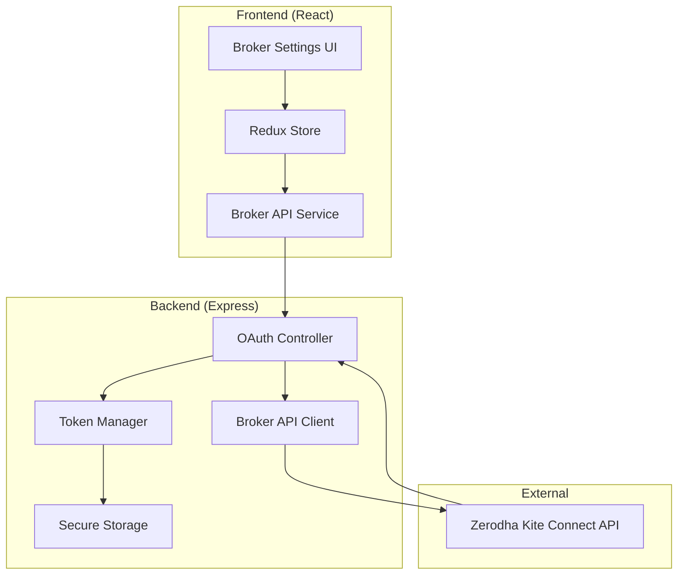
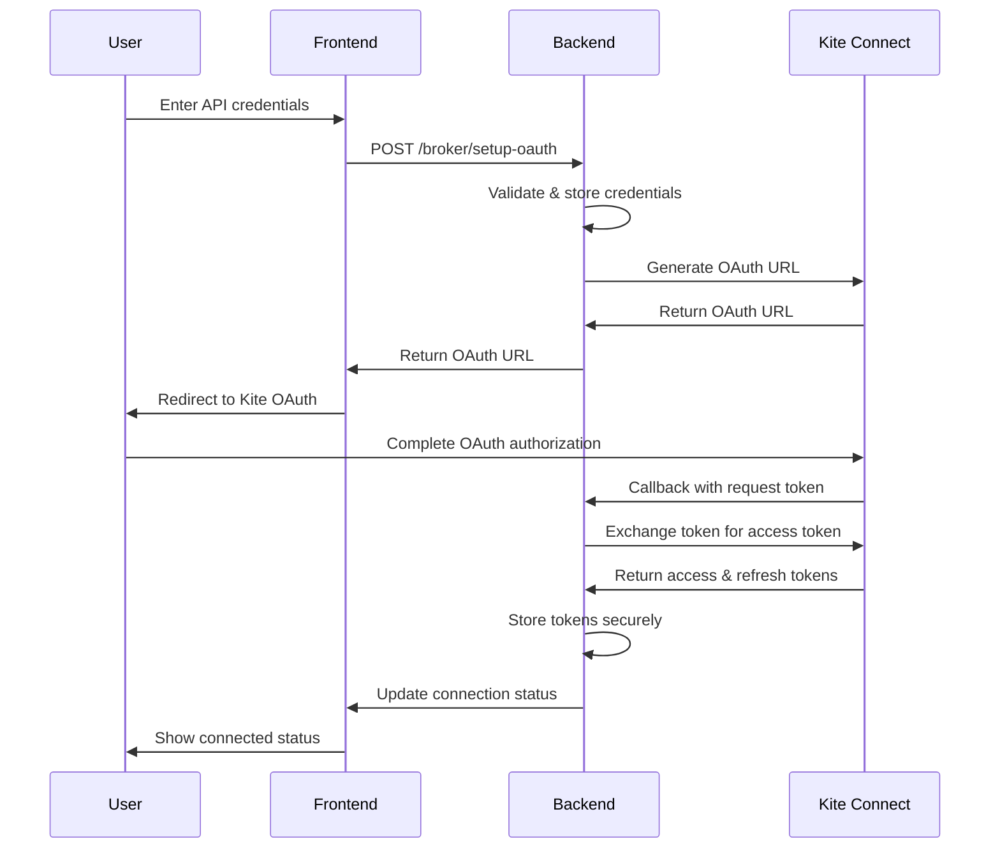

# OAuth Broker Integration Design Document

## Overview

The OAuth Broker Integration system enables secure connection between QuantumLeap and brokerage platforms (starting with Zerodha Kite Connect) using OAuth 2.0 authentication flow. The system handles credential management, OAuth token lifecycle, and secure API communication while providing real-time connection status updates to users.

## Architecture

### High-Level Architecture



### OAuth Flow Sequence



## Components and Interfaces

### Frontend Components

#### 1. BrokerSetup Component
- **Purpose**: Main UI for broker credential management and OAuth initiation
- **Props**: 
  - `onConnectionChange: (status: ConnectionStatus) => void`
  - `initialConfig?: BrokerConfig`
- **State**: 
  - `credentials: { apiKey: string, apiSecret: string }`
  - `connectionStatus: ConnectionStatus`
  - `isLoading: boolean`
  - `error: string | null`

#### 2. ConnectionStatus Component
- **Purpose**: Real-time display of broker connection status
- **Props**:
  - `status: ConnectionStatus`
  - `lastSync?: Date`
  - `onReconnect?: () => void`
- **Features**: Auto-refresh, error display, reconnection controls

#### 3. BrokerConfig Store Slice
- **Purpose**: Redux state management for broker configurations
- **State Shape**:
```typescript
interface BrokerState {
  configs: BrokerConfig[];
  activeConfig: BrokerConfig | null;
  connectionStatus: ConnectionStatus;
  isLoading: boolean;
  error: string | null;
}
```

### Backend Components

#### 1. OAuth Controller (`/controllers/oauthController.js`)
- **Purpose**: Handle OAuth flow endpoints and token management
- **Endpoints**:
  - `POST /broker/setup-oauth` - Initialize OAuth flow
  - `GET /broker/callback` - Handle OAuth callback
  - `POST /broker/refresh-token` - Refresh expired tokens
  - `POST /broker/disconnect` - Revoke tokens and disconnect
  - `GET /broker/status` - Get connection status

#### 2. Token Manager (`/services/tokenManager.js`)
- **Purpose**: Secure token storage and lifecycle management
- **Methods**:
  - `storeTokens(userId, tokens)` - Encrypt and store tokens
  - `getTokens(userId)` - Retrieve and decrypt tokens
  - `refreshTokens(userId)` - Handle token refresh logic
  - `revokeTokens(userId)` - Clean up tokens on disconnect

#### 3. Broker API Client (`/services/brokerClient.js`)
- **Purpose**: Interface with Zerodha Kite Connect API
- **Methods**:
  - `generateOAuthUrl(apiKey, redirectUri)` - Create OAuth URL
  - `generateSession(requestToken, apiKey, apiSecret)` - Exchange tokens
  - `refreshAccessToken(refreshToken, apiKey, apiSecret)` - Refresh tokens
  - `revokeSession(accessToken, apiKey)` - Revoke access

## Data Models

### BrokerConfig Model
```typescript
interface BrokerConfig {
  id: string;
  userId: string;
  brokerName: 'zerodha' | string;
  apiKey: string;
  apiSecret: string; // Encrypted
  isConnected: boolean;
  connectionStatus: ConnectionStatus;
  lastSync?: Date;
  createdAt: Date;
  updatedAt: Date;
}
```

### ConnectionStatus Model
```typescript
interface ConnectionStatus {
  state: 'disconnected' | 'connecting' | 'connected' | 'error' | 'expired';
  message: string;
  lastChecked: Date;
  error?: {
    code: string;
    message: string;
    retryable: boolean;
  };
}
```

### OAuthTokens Model
```typescript
interface OAuthTokens {
  accessToken: string;
  refreshToken?: string;
  expiresAt: Date;
  tokenType: 'Bearer';
  scope?: string[];
}
```

### Database Schema

#### broker_configs table
```sql
CREATE TABLE broker_configs (
  id VARCHAR(36) PRIMARY KEY,
  user_id VARCHAR(36) NOT NULL,
  broker_name VARCHAR(50) NOT NULL,
  api_key VARCHAR(255) NOT NULL,
  api_secret_encrypted TEXT NOT NULL,
  is_connected BOOLEAN DEFAULT FALSE,
  connection_status JSON,
  last_sync TIMESTAMP NULL,
  created_at TIMESTAMP DEFAULT CURRENT_TIMESTAMP,
  updated_at TIMESTAMP DEFAULT CURRENT_TIMESTAMP ON UPDATE CURRENT_TIMESTAMP,
  INDEX idx_user_broker (user_id, broker_name)
);
```

#### oauth_tokens table
```sql
CREATE TABLE oauth_tokens (
  id VARCHAR(36) PRIMARY KEY,
  config_id VARCHAR(36) NOT NULL,
  access_token_encrypted TEXT NOT NULL,
  refresh_token_encrypted TEXT,
  expires_at TIMESTAMP NOT NULL,
  token_type VARCHAR(20) DEFAULT 'Bearer',
  scope JSON,
  created_at TIMESTAMP DEFAULT CURRENT_TIMESTAMP,
  updated_at TIMESTAMP DEFAULT CURRENT_TIMESTAMP ON UPDATE CURRENT_TIMESTAMP,
  FOREIGN KEY (config_id) REFERENCES broker_configs(id) ON DELETE CASCADE,
  INDEX idx_config_id (config_id)
);
```

## Error Handling

### Error Categories

1. **Validation Errors** (400)
   - Invalid API credentials format
   - Missing required parameters
   - Invalid broker configuration

2. **Authentication Errors** (401)
   - Invalid API key/secret
   - Expired access token
   - OAuth authorization denied

3. **Authorization Errors** (403)
   - Insufficient broker permissions
   - Rate limit exceeded
   - Account restrictions

4. **Integration Errors** (502/503)
   - Broker API unavailable
   - Network connectivity issues
   - Timeout errors

### Error Response Format
```typescript
interface ErrorResponse {
  success: false;
  error: {
    code: string;
    message: string;
    details?: any;
    retryable: boolean;
    retryAfter?: number;
  };
  timestamp: string;
}
```

### Frontend Error Handling Strategy

1. **User-Friendly Messages**: Convert technical errors to actionable user messages
2. **Retry Logic**: Automatic retry for transient errors with exponential backoff
3. **Fallback States**: Graceful degradation when broker connection fails
4. **Error Logging**: Comprehensive error tracking for debugging

## Testing Strategy

### Unit Tests

#### Frontend Tests
- **BrokerSetup Component**: Credential validation, OAuth flow initiation, error handling
- **ConnectionStatus Component**: Status display, auto-refresh, reconnection logic
- **BrokerAPI Service**: API calls, error handling, response parsing
- **Redux Store**: State management, action creators, reducers

#### Backend Tests
- **OAuth Controller**: Endpoint responses, error handling, token validation
- **Token Manager**: Encryption/decryption, token refresh, cleanup
- **Broker Client**: API integration, error mapping, retry logic

### Integration Tests

1. **OAuth Flow End-to-End**
   - Complete OAuth authorization flow
   - Token exchange and storage
   - Connection status updates

2. **Token Lifecycle**
   - Token refresh on expiration
   - Automatic reconnection
   - Graceful error handling

3. **Security Tests**
   - Credential encryption/decryption
   - Token storage security
   - API communication security

### Mock Testing Strategy

1. **Zerodha API Mocks**: Simulate OAuth responses, token exchanges, error conditions
2. **Database Mocks**: Test data persistence without actual database
3. **Network Mocks**: Test offline scenarios and network failures

### Test Data Management

```javascript
// Mock OAuth responses for testing
const mockOAuthResponses = {
  success: {
    oauth_url: 'https://kite.zerodha.com/connect/login?api_key=test&v=3',
    state: 'test_state_123'
  },
  tokenExchange: {
    access_token: 'mock_access_token',
    refresh_token: 'mock_refresh_token',
    expires_in: 3600
  },
  error: {
    error_type: 'GeneralException',
    message: 'Invalid API credentials'
  }
};
```

### Performance Testing

1. **Load Testing**: Multiple concurrent OAuth flows
2. **Token Refresh Performance**: High-frequency token refresh scenarios
3. **Database Performance**: Large-scale credential and token storage
4. **API Rate Limiting**: Broker API rate limit handling

### Security Testing

1. **Credential Security**: Verify encryption of stored credentials
2. **Token Security**: Validate secure token storage and transmission
3. **OAuth Security**: Test OAuth flow security and CSRF protection
4. **API Security**: Validate secure communication with broker APIs