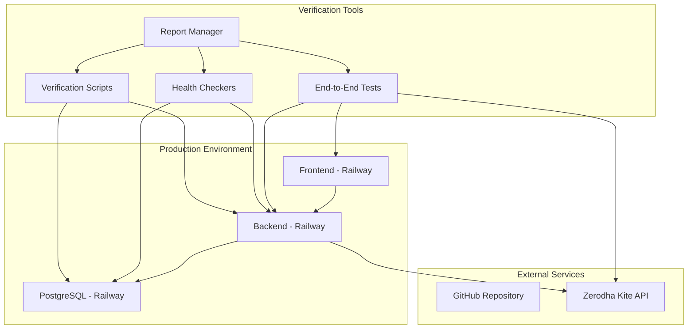
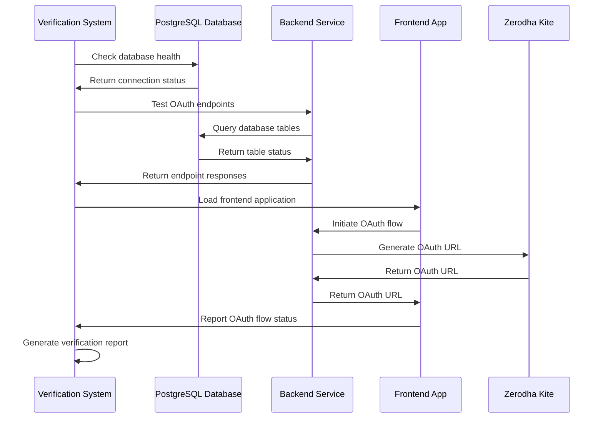

# OAuth Deployment Verification Design Document

## Overview

The OAuth Deployment Verification system provides comprehensive testing and validation of the OAuth broker integration in the production environment. The system uses automated verification scripts, health checks, and end-to-end testing to ensure all components of the OAuth system are functioning correctly after deployment to Railway. This verification process validates database connectivity, backend service health, endpoint functionality, and complete OAuth flow integration.

## Architecture

### High-Level Verification Architecture



### Verification Flow Sequence



## Components and Interfaces

### Verification Scripts

#### 1. Database Schema Verifier (`verify-database-schema.cjs`)
- **Purpose**: Validates database connectivity and schema integrity
- **Endpoints Tested**:
  - `/health` - General application health
  - `/api/modules/auth/broker/health` - OAuth-specific health
  - `/api/modules/auth/broker/setup-oauth` - OAuth setup functionality
  - `/api/modules/auth/broker/status` - Connection status
- **Validations**:
  - Database connection initialization
  - Required tables existence (users, broker_configs, oauth_tokens)
  - oauth_state column presence for CSRF protection
  - Token storage and retrieval functionality

#### 2. OAuth Endpoint Verifier (`verify-oauth-endpoint.cjs`)
- **Purpose**: Tests OAuth endpoint functionality and error handling
- **Test Cases**:
  - Valid OAuth setup requests
  - Invalid request handling
  - Missing parameter validation
  - Auto-generation of user_id
  - Error response formats
- **Expected Responses**:
  - 200 for valid requests with OAuth URL
  - 400 for invalid requests with error details
  - Proper JSON response structure

#### 3. OAuth Setup Tester (`test-oauth-setup.cjs`)
- **Purpose**: Comprehensive testing of OAuth setup endpoint
- **Test Scenarios**:
  - Complete valid requests
  - Partial requests (missing optional fields)
  - Invalid requests (missing required fields)
  - Edge cases (empty payloads, malformed data)
- **Validation Logic**:
  - Status code verification
  - Response structure validation
  - Error message clarity
  - Auto-generation functionality

### Health Check Components

#### 1. Database Health Monitor
- **Purpose**: Continuous monitoring of database connectivity
- **Checks**:
  - PostgreSQL service availability
  - Connection pool status
  - Query execution capability
  - Table accessibility
- **Metrics**:
  - Connection latency
  - Query response time
  - Error rates
  - Connection pool utilization

#### 2. Backend Service Monitor
- **Purpose**: Monitoring backend service health and OAuth functionality
- **Checks**:
  - Service availability
  - OAuth module loading
  - Route registration
  - Environment variable presence
- **Metrics**:
  - Response time
  - Error rates
  - Memory usage
  - OAuth endpoint availability

#### 3. Frontend Integration Monitor
- **Purpose**: Monitoring frontend-backend integration
- **Checks**:
  - Frontend application loading
  - API connectivity
  - OAuth flow initiation
  - Error handling
- **Metrics**:
  - Page load time
  - API call success rate
  - OAuth flow completion rate
  - User experience metrics

### Reporting Components

#### 1. Verification Report Generator
- **Purpose**: Generate comprehensive verification reports
- **Report Sections**:
  - Executive summary
  - Component status overview
  - Detailed test results
  - Issue identification
  - Recommendations
- **Output Formats**:
  - Markdown reports
  - JSON data
  - Console output
  - HTML dashboards

#### 2. Issue Tracker
- **Purpose**: Track and categorize verification issues
- **Issue Categories**:
  - Critical (system non-functional)
  - High (major functionality broken)
  - Medium (minor issues)
  - Low (cosmetic or performance)
- **Issue Management**:
  - Automatic issue detection
  - Priority assignment
  - Resolution tracking
  - Historical analysis

## Data Models

### Verification Result Model
```typescript
interface VerificationResult {
  testName: string;
  status: 'pass' | 'fail' | 'warning';
  timestamp: Date;
  duration: number;
  details: {
    expected: any;
    actual: any;
    error?: string;
  };
  metadata: {
    endpoint?: string;
    method?: string;
    statusCode?: number;
    responseTime?: number;
  };
}
```

### Health Check Model
```typescript
interface HealthCheck {
  component: 'database' | 'backend' | 'frontend';
  status: 'healthy' | 'degraded' | 'unhealthy';
  lastChecked: Date;
  metrics: {
    responseTime: number;
    errorRate: number;
    availability: number;
  };
  issues: Issue[];
}
```

### Verification Report Model
```typescript
interface VerificationReport {
  id: string;
  timestamp: Date;
  overallStatus: 'pass' | 'fail' | 'partial';
  summary: {
    totalTests: number;
    passed: number;
    failed: number;
    warnings: number;
  };
  components: {
    database: HealthCheck;
    backend: HealthCheck;
    frontend: HealthCheck;
  };
  testResults: VerificationResult[];
  issues: Issue[];
  recommendations: string[];
}
```

### Issue Model
```typescript
interface Issue {
  id: string;
  severity: 'critical' | 'high' | 'medium' | 'low';
  category: 'database' | 'backend' | 'frontend' | 'integration';
  title: string;
  description: string;
  impact: string;
  resolution: string;
  status: 'open' | 'in-progress' | 'resolved';
  detectedAt: Date;
  resolvedAt?: Date;
}
```

## Error Handling

### Error Categories

1. **Database Errors**
   - Connection failures
   - Schema mismatches
   - Query execution errors
   - Performance issues

2. **Backend Service Errors**
   - Service unavailability
   - OAuth endpoint failures
   - Authentication errors
   - Configuration issues

3. **Frontend Integration Errors**
   - Application loading failures
   - API connectivity issues
   - OAuth flow interruptions
   - User interface errors

4. **Network and Infrastructure Errors**
   - Railway service outages
   - DNS resolution issues
   - SSL certificate problems
   - Rate limiting

### Error Response Handling

```typescript
interface ErrorResponse {
  success: false;
  error: {
    code: string;
    message: string;
    category: 'database' | 'backend' | 'frontend' | 'network';
    severity: 'critical' | 'high' | 'medium' | 'low';
    timestamp: string;
    context: any;
    resolution?: string;
  };
}
```

### Error Recovery Strategies

1. **Automatic Retry Logic**
   - Exponential backoff for transient errors
   - Maximum retry limits
   - Circuit breaker patterns
   - Graceful degradation

2. **Fallback Mechanisms**
   - Alternative endpoint testing
   - Mock data for testing
   - Cached results when appropriate
   - Partial verification modes

3. **Error Reporting**
   - Detailed error logging
   - Issue categorization
   - Resolution recommendations
   - Historical error tracking

## Testing Strategy

### Verification Test Levels

#### 1. Unit-Level Verification
- **Database Connection Tests**: Individual connection validation
- **Endpoint Response Tests**: Single endpoint functionality
- **Configuration Tests**: Environment variable validation
- **Security Tests**: Authentication and authorization checks

#### 2. Integration-Level Verification
- **Database-Backend Integration**: End-to-end data flow
- **Backend-Frontend Integration**: API communication
- **OAuth Flow Integration**: Complete authentication process
- **External Service Integration**: Zerodha API connectivity

#### 3. System-Level Verification
- **Complete OAuth Flow**: End-to-end user journey
- **Performance Testing**: Load and stress testing
- **Security Testing**: Vulnerability assessment
- **Disaster Recovery**: Failure scenario testing

### Test Data Management

```javascript
// Test data sets for verification
const testDataSets = {
  validOAuthRequest: {
    api_key: 'test_api_key_1234567890',
    api_secret: 'test_api_secret_1234567890',
    user_id: 'test_user_verification',
    frontend_url: 'https://quantum-leap-frontend-production.up.railway.app'
  },
  invalidRequests: [
    { api_secret: 'test_secret' }, // Missing api_key
    { api_key: 'test_key' }, // Missing api_secret
    { api_key: 'short', api_secret: 'test_secret' }, // Invalid format
    {} // Empty request
  ],
  edgeCases: [
    { api_key: 'test_key', api_secret: 'test_secret' }, // No user_id (auto-generate)
    { api_key: 'test_key', api_secret: 'test_secret', user_id: '' }, // Empty user_id
  ]
};
```

### Verification Automation

#### 1. Continuous Verification
- **Scheduled Health Checks**: Regular system monitoring
- **Deployment Verification**: Post-deployment validation
- **Performance Monitoring**: Ongoing system metrics
- **Alert Systems**: Automatic issue notification

#### 2. Verification Pipelines
- **Pre-deployment Verification**: Staging environment testing
- **Post-deployment Verification**: Production validation
- **Regression Testing**: Ongoing functionality verification
- **Performance Benchmarking**: System performance tracking

#### 3. Reporting Automation
- **Automated Report Generation**: Scheduled verification reports
- **Dashboard Updates**: Real-time status dashboards
- **Alert Notifications**: Issue detection and notification
- **Historical Tracking**: Long-term trend analysis

### Production Environment Considerations

#### 1. Railway-Specific Verification
- **Service Health Monitoring**: Railway service status
- **Environment Variable Validation**: Configuration verification
- **Deployment Status Checking**: Code deployment validation
- **Resource Usage Monitoring**: Performance metrics

#### 2. Security Verification
- **HTTPS Enforcement**: SSL certificate validation
- **CORS Configuration**: Cross-origin request handling
- **Rate Limiting**: API protection verification
- **Data Encryption**: Sensitive data protection

#### 3. Performance Verification
- **Response Time Monitoring**: API performance tracking
- **Database Performance**: Query optimization verification
- **Frontend Performance**: User experience metrics
- **Scalability Testing**: Load handling verification

## Deployment Verification Workflow

### Pre-Verification Setup
1. **Environment Validation**: Verify all services are running
2. **Configuration Check**: Validate environment variables
3. **Dependency Verification**: Ensure all dependencies are available
4. **Test Data Preparation**: Set up verification test data

### Verification Execution
1. **Database Verification**: Schema and connectivity testing
2. **Backend Verification**: OAuth endpoint functionality
3. **Frontend Verification**: User interface and integration
4. **End-to-End Verification**: Complete OAuth flow testing

### Post-Verification Analysis
1. **Result Compilation**: Aggregate all test results
2. **Issue Identification**: Categorize and prioritize issues
3. **Report Generation**: Create comprehensive verification report
4. **Recommendation Development**: Provide actionable next steps

### Verification Success Criteria
- All critical tests pass (100% pass rate for critical functionality)
- No high-severity issues identified
- Performance metrics within acceptable ranges
- Security validations successful
- End-to-end OAuth flow functional